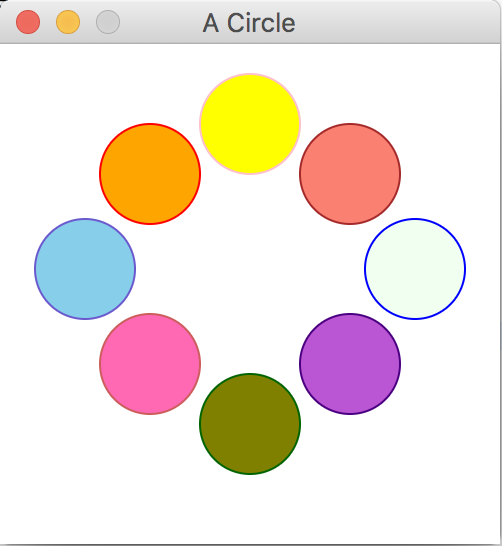

## DESCRIPTION
This is a project that will output a JavaFX stage with a scene.
There are six Circle objects, all with separate borders and colors. I used the Circle class to create new Circle objects, then the Color class class to change the colors of the circles. With coordination, the circles all take place within a Pane object so that they form a circle.

